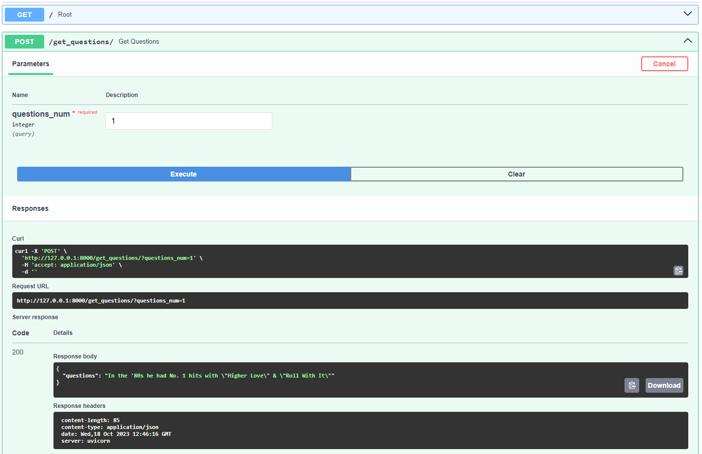

# FastApiProject

---

Проект используется для получения случайных вопросов из набора данных, связанных с игрой "Jeopardy!" в формате JSON. 

## Установка

Чтобы установить проект, выполните следующие команды:


1. Создайте виртуальное окружение (в данном примере мы используем `virtualenv` для создания виртуального окружения):

   ```bash
   # Установка virtualenv (если не установлен)
   pip install virtualenv

   # Создание виртуального окружения
   virtualenv myenv
   ```

2. Активируйте виртуальное окружение:

   - В Windows:

   ```
   myenv\Scripts\activate
   ```

   - В macOS и Linux:

   ```bash
   source myenv/bin/activate
   ```

3. Клонируйте репозиторий с использованием Git:

   ```bash
   git clone https://github.com/zaphire12/fastApiProject.git
   ```
4.  Разверните базу данных используя файл [docker-compose.yml](docker-compose.yml):
    > Далее в проекте мы используем Docker и Docker Compose. Прежде чем начать, убедитесь, что Docker и Docker Compose установлены на вашем компьютере.
  Если они не установлены, выполните установку Docker согласно официальным инструкциям.
   ```bash
   docker-compose -f docker-compose.yml up
   ```
   
5. Разверните FastApi приложения используя файл [my-app-compose.yml](my-app-compose.yml)

   ```bash
   docker-compose -f my-app-compose.yml up
   ```


## Руководство пользователя

### Далее будут приведены два варианта взаимодействия с API

* FastAPI автоматически генерирует интерактивную документацию на основе аннотаций Python-кода и комментариев. Для просмотра документации, перейдите в браузере по адресу http://127.0.0.1:8000/docs. Там вы увидите интерфейс, который предоставляет информацию о доступных маршрутах, запросах и моделях данных.
Вы можете использовать интерактивную документацию для тестирования вашего API. Просто выберите маршрут, введите параметры и выполните запросы для проверки, как ваше API работает



* Библиотека requests в Python предоставляет простой и удобный способ выполнения HTTP-запросов к внешним веб-ресурсам. Вот как грамотно описать использование requests
    > Установите библиотеку requests
       ```
           pip install requests
       ```

    Запустите файл [req.py](req.py) используя команду:
   ```bash
       python req.py
   ```
